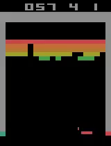

See http://rll.berkeley.edu/deeprlcourse/f17docs/hw3.pdf for instructions

The starter code was based on an implementation of Q-learning for Atari
generously provided by Szymon Sidor from OpenAI

`python run_dqn_atari.py` trains a game agent to play any of the atari games you specify from OpenAI gym, default game is set to breakout

Here's a gif of the game agent playing breakout 

